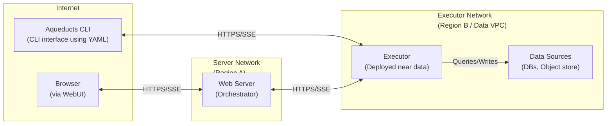

# Aqueducts Architecture

## Overview

Aqueducts is a framework to write and execute ETL data pipelines declaratively. It allows you to define multi-step data transformation processes in YAML, JSON, or TOML format and execute them either locally or remotely.

## Components

Aqueducts consists of several components:

- **Core Library**: The main engine for defining and executing data pipelines
- **CLI**: Command-line interface to run pipelines locally or connect to remote executors
- **Executor**: Server component for running pipelines remotely, closer to data sources
- **Server**: _TODO_ A web platform with a UI to create/manage and trigger aqueducts

## System Architecture

The executor can be registered to an Aqueducts server or connected to directly by the CLI. In either case, an API key is required which can be configured on the executor startup. Additionally configurable is a max memory pool that the executor can use.

Each execution is exclusive on the executor which means that only one Aqueduct can be run at a time. This is important due to the nature of the performance-heavy computations each pipeline can trigger.

Connecting to the executor is done via HTTPS. When connecting to the executor, a Server-Sent Events channel is opened to communicate back to the client. This facilitates outputting executor logs and progress to the client. An execution will be cancelled if the client disconnects, or manually cancels the execution.

## Pipeline Architecture

An aqueduct is a pipeline definition and consists of 3 main parts:

- **Source**: The source data for this pipeline
- **Stage**: Transformations applied within this pipeline
- **Destination**: Output of the pipeline result

### Source

An Aqueduct source can be:

- CSV or Parquet file(s)
  - single file
  - directory
- Delta table
- ODBC query (EXPERIMENTAL)

For file-based sources, a schema can be provided optionally.

The source is registered within the `SessionContext` as a table that can be referenced using the source's configured name. A prerequisite here is that the necessary features for the underlying object stores are enabled. This can be provided by an external `SessionContext` passed into the `run_pipeline` function or by registering the correct handlers for deltalake.

#### ODBC support

It is possible to query various databases using ODBC. This is enabled through [arrow-odbc](https://crates.io/crates/arrow-odbc).
Besides enabling the `odbc` feature flag in your `Cargo.toml` there are some other prerequisites for the executing system:

- `unixodbc` on unix based systems
- ODBC driver for the database you want to access like [ODBC Driver for SQL server](https://learn.microsoft.com/en-us/sql/connect/odbc/download-odbc-driver-for-sql-server) or [psqlodbc](https://github.com/postgresql-interfaces/psqlodbc)
- registering the driver in the ODBC manager configuration (usually located in `/etc/odbcinst.ini`)

### Stage

An Aqueduct stage defines a transformation using SQL. Each stage has access to all defined sources and to every previously executed stage within the SQL context using the respectively configured names. Once executed the stage will then persist its result into the SQL context making it accessible to downstream consumers.

The stage can be set to print the result and/or the result schema to the `stdout`. This is useful for development/debugging purposes.

Nested stages are executed in parallel.

### Destination

An Aqueduct destination can be:

- CSV or Parquet file(s)
  - single file
  - directory
- Delta table
- ODBC query

An Aqueduct destination is the target for the execution of the pipeline. The result of the final stage that was executed is used as the input for the destination to write the data to the underlying table/file.

#### File based destinations

File-based destinations have support for HDFS style partitioning (`output/location=1/...`) and can be set to output only a single file or multiple files based on the configuration.

#### Delta Table destination

For a DeltaTable there is some additional logic that is utilized to maintain the table integrity.

The destination will first cast and validate the schema of the input data and then use one of 3 configurable modes to write the data:

- **Append**: Appends the data to the destination
- **Upsert**: Merges the data to the destination, using the provided configuration for this mode to identify cohort columns that are used to determine which data should be updated
  - provided merge columns are used to check equality e.g. `vec!["date", "country"]` -> update data where `old.date = new.date AND old.country = new.country`
- **Replace**: Replaces the data using a configurable predicate to determine which data should be replaced by the operation
  - provided replacement conditions are used to check equality e.g. `ReplacementCondition { column: "date", value: "1970-01-01" }` -> replace data where `old.date = '1970-01-01'`

## Remote Execution

The CLI can connect to a remote Aqueducts Executor to run pipelines close to the data source. This is especially useful for:

1. Executing pipelines within secure networks without exposing data
2. Running heavy queries on dedicated hardware
3. Processing data near storage to minimize network transfer
4. Providing a consistent execution environment

For remote execution:

1. Deploy an Aqueducts Executor in your environment
2. Configure it with an API key
3. Enable networking for the CLI to be able to connect
4. Run pipelines using the `--executor` and `--api-key` options

The CLI will:
- Verify connectivity to the executor
- Parse and render the Aqueducts template
- Send the pipeline definition to the executor
- Stream progress events in real-time
- Display results and execution status

## Memory Management

The executor implements memory limits using DataFusion's runtime environment to avoid out-of-memory errors during query execution:

- **Memory Management**: Utilizes DataFusion's runtime environment memory limits to control memory usage across query operators
- **Configuration**: Set via `--max-memory` parameter or `AQUEDUCTS_MAX_MEMORY` environment variable (in GB)
- **Default**: Unlimited memory usage when unspecified

The memory limit controls allocation for:
- Loading and processing data from sources
- Intermediate query operations (joins, aggregations, sorting)
- Spill-to-disk operations when memory limits are reached
- Final result materialization before writing to destinations

When a query approaches the memory limit:
1. DataFusion will attempt to spill data to disk for operations that support it
2. Some operations may fail explicitly rather than cause system-wide out-of-memory errors
3. Progress events will indicate when memory limits are affecting performance

## Technology Stack

This framework builds on the fantastic work done by projects such as:

- [arrow-rs](https://github.com/apache/arrow-rs)
- [datafusion](https://github.com/apache/datafusion)
- [delta-rs](https://github.com/delta-io/delta-rs)
