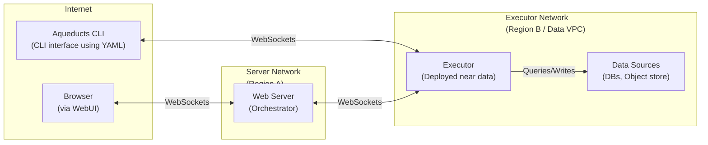

# Aqueducts Architecture

## Overview

Aqueducts is a framework to write and execute ETL data pipelines declaratively. It allows you to define multi-step data transformation processes in YAML, JSON, or TOML format with v2 schema support and execute them either locally, remotely, or embedded in your applications.

## Components

Aqueducts follows a modular architecture with clear separation of concerns:

### Library Crates

- **Meta Crate** (`aqueducts`): Unified interface providing all functionality through feature flags
- **Core Library** (`aqueducts-core`): Pipeline execution engine with unified error handling
- **Schema Library** (`aqueducts-schemas`): Configuration types, validation, and v2 format support
- **Provider Libraries**: 
  - `aqueducts-delta`: Delta Lake integration
  - `aqueducts-odbc`: ODBC database connectivity

### Applications

- **CLI** (`aqueducts-cli`): Command-line interface for local and remote execution
- **Executor** (`aqueducts-executor`): Server component for remote pipeline execution
- **Server**: _TODO_ A web platform with UI for pipeline management

## System Architecture



The executor can be registered to an Aqueducts server or connected to directly by the CLI. In either case, an API key is required which can be configured on the executor startup. Additionally configurable is a max memory pool that the executor can use.

Each execution is exclusive on the executor which means that only one Aqueduct can be run at a time. This is important due to the nature of the performance-heavy computations each pipeline can trigger.

Connecting to the executor is done via HTTPS. When connecting to the executor, a Server-Sent Events channel is opened to communicate back to the client. This facilitates outputting executor logs and progress to the client. An execution will be cancelled if the client disconnects, or manually cancels the execution.

## Pipeline Architecture

An aqueduct is a pipeline definition consisting of 3 main parts with v2 schema support:

- **Source**: The source data for this pipeline
- **Stage**: Transformations applied within this pipeline  
- **Destination**: Output of the pipeline result

### Configuration Format

Aqueducts supports v2 configuration format with:

```yaml
version: "v2"
sources:
  - type: file  # lowercase types
    name: my_data
    format:    # 'format' instead of 'file_type'
      type: csv
      options:
        has_header: true

stages:
  - - name: transform
      query: "SELECT * FROM my_data"

destination:
  type: delta
  name: output
  location: "s3://bucket/output/"
  storage_config: {}  # 'storage_config' instead of 'storage_options'
  partition_columns: ["date"]  # 'partition_columns' instead of 'partition_cols'
  write_mode:
    operation: append  # lowercase operations
```

### Source

An Aqueduct source can be:

- **File sources** (`type: file`):
  - CSV, JSON, JSONL, Parquet files
  - Single file or directory
  - Local filesystem or cloud storage (S3, GCS, Azure)
- **Delta table** (`type: delta`):
  - Delta Lake tables with time travel support
  - Cloud storage integration
- **ODBC sources** (`type: odbc`):
  - SQL Server, PostgreSQL, MySQL, etc.
  - Custom connection strings and queries

For file-based sources, schema can be provided optionally with detailed type information:

```yaml
sources:
  - type: file
    name: sales_data
    format:
      type: csv
      options:
        has_header: true
        schema:
          - name: order_id
            data_type: int64
            nullable: false
            description: "Unique order identifier"
    location: "s3://data/sales.csv"
    storage_config:
      AWS_REGION: "us-west-2"
```

The source is registered within the `SessionContext` as a table that can be referenced using the source's configured name. Features for underlying object stores are automatically enabled through the meta crate's feature flags.

#### ODBC support

It is possible to query various databases using ODBC. This is enabled through [arrow-odbc](https://crates.io/crates/arrow-odbc).
Besides enabling the `odbc` feature flag in your `Cargo.toml` there are some other prerequisites for the executing system:

- `unixodbc` on unix based systems
- ODBC driver for the database you want to access like [ODBC Driver for SQL server](https://learn.microsoft.com/en-us/sql/connect/odbc/download-odbc-driver-for-sql-server) or [psqlodbc](https://github.com/postgresql-interfaces/psqlodbc)
- registering the driver in the ODBC manager configuration (usually located in `/etc/odbcinst.ini`)

### Stage

An Aqueduct stage defines a transformation using SQL. Each stage has access to all defined sources and to every previously executed stage within the SQL context using the respectively configured names. Once executed the stage will then persist its result into the SQL context making it accessible to downstream consumers.

The stage can be set to print the result and/or the result schema to the `stdout`. This is useful for development/debugging purposes.

Nested stages are executed in parallel.

### Destination

An Aqueduct destination can be:

- CSV or Parquet file(s)
  - single file
  - directory
- Delta table
- ODBC query

An Aqueduct destination is the target for the execution of the pipeline. The result of the final stage that was executed is used as the input for the destination to write the data to the underlying table/file.

#### File based destinations

File-based destinations have support for HDFS style partitioning (`output/location=1/...`) and can be set to output only a single file or multiple files based on the configuration.

#### Delta Table destination

For a Delta table destination, additional logic maintains table integrity with ACID guarantees.

The destination will first cast and validate the schema of the input data and then use one of 3 configurable modes:

- **append**: Appends the data to the destination
- **upsert**: Merges the data using specified merge keys:
  ```yaml
  write_mode:
    operation: upsert
    params: ["date", "country"]
  ```
  Updates data where `old.date = new.date AND old.country = new.country`
  
- **replace**: Replaces data matching specified conditions:
  ```yaml
  write_mode:
    operation: replace
    params:
      - column: "date" 
        value: "2024-01-01"
  ```
  Replaces data where `old.date = '2024-01-01'`

## Remote Execution

The CLI can connect to a remote Aqueducts Executor to run pipelines close to the data source. This is especially useful for:

1. Executing pipelines within secure networks without exposing data
2. Running heavy queries on dedicated hardware
3. Processing data near storage to minimize network transfer
4. Providing a consistent execution environment

For remote execution:

1. Deploy an Aqueducts Executor in your environment
2. Configure it with an API key
3. Enable networking for the CLI to be able to connect
4. Run pipelines using the `--executor` and `--api-key` options

The CLI will:
- Verify connectivity to the executor
- Parse and render the Aqueducts template
- Send the pipeline definition to the executor
- Stream progress events in real-time
- Display results and execution status

## Memory Management

The executor implements memory limits using DataFusion's runtime environment to avoid out-of-memory errors during query execution:

- **Memory Management**: Utilizes DataFusion's runtime environment memory limits to control memory usage across query operators
- **Configuration**: Set via `--max-memory` parameter or `AQUEDUCTS_MAX_MEMORY` environment variable (in GB)
- **Default**: Unlimited memory usage when unspecified

The memory limit controls allocation for:
- Loading and processing data from sources
- Intermediate query operations (joins, aggregations, sorting)
- Spill-to-disk operations when memory limits are reached
- Final result materialization before writing to destinations

When a query approaches the memory limit:
1. DataFusion will attempt to spill data to disk for operations that support it
2. Some operations may fail explicitly rather than cause system-wide out-of-memory errors
3. Progress events will indicate when memory limits are affecting performance

## Error Handling Architecture

Aqueducts implements a unified error handling system across all components:

### Semantic Error Types

All operations return semantic errors through the unified `AqueductsError` type:

- **Config**: Configuration validation errors
- **DataProcessing**: Query execution and data transformation errors  
- **SchemaValidation**: Schema mismatch and validation errors
- **Storage**: File system and object store errors
- **Source/Destination**: Provider-specific errors with context
- **Template**: Parameter substitution and parsing errors

### Error Conversion

External errors are automatically converted to semantic categories:

```rust
// DataFusion errors → DataProcessing
// Arrow errors → DataProcessing  
// Object store errors → Storage
// Delta errors → destination-specific errors
// ODBC errors → source/destination-specific (with credential protection)
```

### Security

ODBC errors never expose connection strings or credentials in error messages to prevent password leakage.

## Technology Stack

This framework builds on the fantastic work done by projects such as:

- [arrow-rs](https://github.com/apache/arrow-rs): Memory model and data structures
- [datafusion](https://github.com/apache/datafusion): SQL execution engine
- [delta-rs](https://github.com/delta-io/delta-rs): Delta Lake support
- [object_store](https://github.com/apache/arrow-rs/tree/master/object_store): Cloud storage abstraction
- [arrow-odbc](https://github.com/pacman82/arrow-odbc): ODBC connectivity
