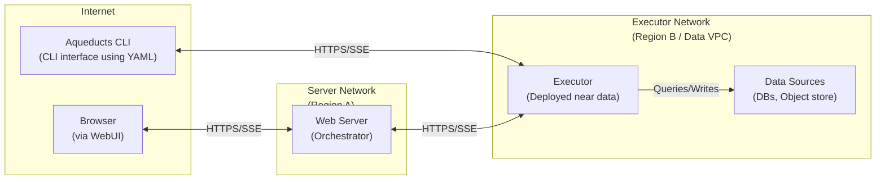

# Aqueducts Executor

This is a deployable application that is used to execute Aqueduct pipeline definitions within your infrastructure.
The main use-case for this is to execute heavy queries within the infrastructure where the data is hosted, minimizing the network
load on the client side and additionally removing the requirement for the client to have direct access to the data store.

## Architecture



The executor can be registered to an Aqueducts server or connected to directly by the CLI. In either case an API key is required which can be configured
on the executor startup. Additionally configurable is a max memory pool that the executor can use.

Each execution is exclusive on the executor which means that only one Aqueduct can be run at a time. This is important due to the nature of the performance heavy
computations each pipeline can trigger.

Connecting to the executor is done via HTTPS. When connecting to the executor a Server-Sent Events channel is opened to communicate back to the client. This
facilitates outputting executor logs and progress to the client. An execution will be cancelled if the client disconnects, or manually cancels the execution.

## Features

- **Remote Execution**: Run data pipelines securely within your own infrastructure close to the data sources
- **Memory Management**: Configure maximum memory usage to control resource allocation using DataFusion's memory pool
- **Security**: API key authentication ensures secure access to the executor
- **Real-time Feedback**: Server-Sent Events provide live progress and log updates to clients
- **Cloud Storage Support**: Native integration with S3, GCS, and Azure Blob Storage
- **Database Connectivity**: ODBC support for connecting to various database systems
- **Format Flexibility**: Process data in YAML, JSON, and TOML formats
- **Scalability**: Deploy multiple executors across different regions as needed
- **Exclusive Execution**: Guaranteed single-pipeline execution to optimize resource utilization

## Configuration Options

| Option          | Description                                         | Default        | Environment Variable    |
|-----------------|-----------------------------------------------------|----------------|-------------------------|
| `--api-key`     | API key for authentication                          | -              | `AQUEDUCTS_API_KEY`     |
| `--host`        | Host address to bind to                             | 0.0.0.0        | `AQUEDUCTS_HOST`        |
| `--port`        | Port to listen on                                   | 8080           | `AQUEDUCTS_PORT`        |
| `--max-memory`  | Maximum memory usage in GB (0 for unlimited)        | 0              | `AQUEDUCTS_MAX_MEMORY`  |
| `--server-url`  | URL of Aqueducts server for registration (optional) | -              | `AQUEDUCTS_SERVER_URL`  |
| `--executor-id` | Unique identifier for this executor                 | auto-generated | `AQUEDUCTS_EXECUTOR_ID` |
| `--log-level`   | Logging level (info, debug, trace)                  | info           | `AQUEDUCTS_LOG_LEVEL`   |

## API Reference

### Authentication

The executor uses API key authentication. The API key should be provided via the api key header:

**X-API-Key header**:
```
X-API-Key: your_api_key_here
```

### Endpoints

| Endpoint       | Method | Authentication | Description                                        |
|----------------|--------|----------------|----------------------------------------------------|
| `/health`      | GET    | No             | Basic health check to verify the service is running |
| `/status`      | GET    | Yes            | Get current executor status and execution details  |
| `/execute`     | POST   | Yes            | Execute a pipeline with real-time progress updates |
| `/cancel`      | POST   | Yes            | Cancel a running pipeline execution                |

### Pipeline Execution

To execute a pipeline, send a POST request to `/execute` with your pipeline definition in JSON format:

```json
{
  "pipeline": {
    "sources": [...],
    "stages": [...],
    "destination": {...}
  }
}
```

The executor expects a JSON object that matches the Aqueduct pipeline structure with `sources`, `stages`, and optional `destination` fields. All pipeline parameters should be pre-populated before submission as the executor does not support parameter substitution.

The `stages` field is an array of arrays, where the outer array represents sequential stage groups and the inner arrays represent parallel stages. The progress tracker uses both position (outer array index) and sub-position (inner array index) to track progress for each stage.

The response is a Server-Sent Events stream with real-time execution updates:

```json
{
  "event_type": "started",
  "message": "Pipeline execution started",
  "progress": 0,
  "execution_id": "unique-execution-id",
  "current_stage": null,
  "error": null
}

{
  "event_type": "progress",
  "message": "Processing stage: load_data (position: 0, sub-position: 0)",
  "progress": 30,
  "execution_id": "unique-execution-id",
  "current_stage": "load_data:0_0",
  "error": null
}

{
  "event_type": "completed",
  "message": "Pipeline execution completed successfully",
  "progress": 100,
  "execution_id": "unique-execution-id",
  "current_stage": null,
  "error": null
}
```

In case of errors, an error event is sent:

```json
{
  "event_type": "error",
  "message": "Pipeline execution failed",
  "progress": null,
  "execution_id": "unique-execution-id",
  "current_stage": "transform_data",
  "error": "Error details: Failed to execute SQL query"
}
```

### Pipeline Cancellation

To cancel a running pipeline execution, send a POST request to `/cancel`:

```json
{
  "execution_id": "unique-execution-id"  // Optional - if omitted, will cancel the current execution
}
```

The response will indicate whether the cancellation was successful:

```json
{
  "status": "cancelled",
  "message": "Pipeline execution cancelled successfully",
  "cancelled_execution_id": "unique-execution-id"
}
```

If no execution is running:

```json
{
  "status": "not_running",
  "message": "No pipeline execution is currently running",
  "cancelled_execution_id": null
}
```

If you provide an execution ID that doesn't match the currently running execution:

```json
{
  "status": "not_found",
  "message": "Execution ID 'wrong-id' not found. Current execution has ID 'actual-id'",
  "cancelled_execution_id": null
}
```

When a pipeline is cancelled, it will emit a special SSE event:

```json
{
  "event_type": "cancelled",
  "message": "Pipeline execution cancelled",
  "execution_id": "unique-execution-id"
}
```

### Concurrent Execution Handling

The executor processes only one pipeline at a time. If you attempt to execute a pipeline when one is already running:

1. You'll receive a `429 Too Many Requests` response
2. The response includes details about the currently running execution
3. A `Retry-After` header indicates when to retry (in seconds)
4. Standard rate limit headers (`X-RateLimit-*`) provide additional context

Example response:
```json
{
  "error": "A pipeline is already running (ID: abc-123). Please retry after 30 seconds",
  "execution_id": "abc-123",
  "retry_after": 30
}
```

## Deployment

### Manual deployment

Install the application using cargo install:

```bash
# Standard installation with all cloud storage features
cargo install aqueducts-executor

# Installation with ODBC support
cargo install aqueducts-executor --features odbc
```

#### ODBC Configuration Requirements

ODBC support requires the UnixODBC library to be installed on your system, along with any database-specific drivers.

##### Ubuntu/Debian
```bash
# Install UnixODBC development libraries
sudo apt-get update
sudo apt-get install unixodbc-dev

# Add database-specific drivers (examples)
# For PostgreSQL
sudo apt-get install odbc-postgresql

# For MySQL
sudo apt-get install libmyodbc
```

##### Fedora/RHEL/CentOS
```bash
# Install UnixODBC development libraries
sudo dnf install unixODBC-devel

# Add database-specific drivers (examples)
# For PostgreSQL
sudo dnf install postgresql-odbc

# For MySQL
sudo dnf install mysql-connector-odbc
```

##### macOS
Installation on macOS can be more complex due to driver management:
```bash
# Install UnixODBC via Homebrew
brew install unixodbc

# For database drivers, use Homebrew if available or download from the database vendor
# PostgreSQL example
brew install psqlodbc

# MySQL example
brew install mysql-connector-c++
```

After installing drivers, you'll need to configure your DSN in the `odbcinst.ini` and `odbc.ini` files. Typical locations:
- Linux: `/etc/odbcinst.ini` and `/etc/odbc.ini`
- macOS with Homebrew: `$(brew --prefix)/etc/odbcinst.ini` and `$(brew --prefix)/etc/odbc.ini`

For macOS, you may need to set environment variables for unixODBC:
```bash
export DYLD_LIBRARY_PATH=$(brew --prefix)/lib:$DYLD_LIBRARY_PATH
```

### Docker deployment

There are pre-built Docker images available:

- `vigimite/aqueducts-executor`

Example usage:
```bash
# Standard image
docker run -p 3031:3031 \
  -e AQUEDUCTS_API_KEY=your_api_key \
  -e AQUEDUCTS_MAX_MEMORY=8 \  # Allocate 8GB for query processing memory pool (0 for unlimited)
  vigimite/aqueducts-executor

# With ODBC support
docker run -p 3031:3031 \
  -e AQUEDUCTS_API_KEY=your_api_key \
  -e AQUEDUCTS_MAX_MEMORY=8 \
  -v /path/to/odbc.ini:/etc/odbc.ini \
  -v /path/to/odbcinst.ini:/etc/odbcinst.ini \
  vigimite/aqueducts-executor:odbc
```

For ODBC connections in Docker, you'll need to:
1. Mount your ODBC configuration files into the container
2. Possibly mount driver libraries if they're not included in the image
3. Set appropriate environment variables for connection strings

For complex ODBC setups, consider creating a custom Dockerfile:
```dockerfile
FROM vigimite/aqueducts-executor:odbc

# Install additional ODBC drivers
RUN apt-get update && apt-get install -y --no-install-recommends \
    msodbcsql17 \
    && apt-get clean \
    && rm -rf /var/lib/apt/lists/*

# Add your ODBC configuration
COPY odbc.ini /etc/odbc.ini
COPY odbcinst.ini /etc/odbcinst.ini

# Set any needed environment variables
ENV ODBCSYSINI=/etc
```

### Environment Setup

For proper functionality, ensure the following:

1. **ODBC Configuration** (when using the `--features odbc` option):
   - Install UnixODBC and appropriate database drivers on the host system
   - Configure your DSNs in the standard ODBC configuration files
   - For a quick test to verify your ODBC setup works:
     ```bash
     isql -v YOUR_DSN YOUR_USERNAME YOUR_PASSWORD
     ```
   - Consider setting these environment variables for troubleshooting:
     ```bash
     export ODBCINI=/path/to/odbc.ini
     export ODBCSYSINI=/directory/containing/odbcinst.ini
     export ODBCTRACE=YES  # Enables ODBC tracing for debugging
     ```

2. **Cloud Storage Configuration**:
   - AWS: 
     ```
     AWS_ACCESS_KEY_ID=your_key
     AWS_SECRET_ACCESS_KEY=your_secret
     AWS_REGION=us-west-2  # Optional, but recommended
     ```
   - GCS: 
     ```
     GOOGLE_APPLICATION_CREDENTIALS=/path/to/service-account.json
     ```
   - Azure: 
     ```
     AZURE_STORAGE_ACCOUNT=your_account
     AZURE_STORAGE_KEY=your_key
     ```

## Memory Management

The executor implements memory limits using DataFusion's runtime environment to avoid out-of-memory errors during query execution:

- **Memory Management**: Utilizes DataFusion's runtime environment memory limits to control memory usage across query operators
- **Configuration**: Set via `--max-memory` parameter or `AQUEDUCTS_MAX_MEMORY` environment variable (in GB)
- **Default**: Unlimited memory usage when set to 0 or not specified

The memory limit controls allocation for:
- Loading and processing data from sources
- Intermediate query operations (joins, aggregations, sorting)
- Spill-to-disk operations when memory limits are reached
- Final result materialization before writing to destinations

When a query approaches the memory limit:
1. DataFusion will attempt to spill data to disk for operations that support it
2. Some operations may fail explicitly rather than cause system-wide out-of-memory errors
3. Progress events will indicate when memory limits are affecting performance

For memory-intensive workloads, increase the `--max-memory` parameter based on your executor's available system memory.

## Health Checks

The executor provides health endpoints:
- GET `/health` - Basic health check

## Example Usage

When using the CLI to connect directly to an executor:

```bash
aqueducts run --executor http://executor-host:8080 --api-key your_api_key pipeline.yml
```

When registering with an Aqueducts server:

```bash
aqueducts-executor --server-url https://aqueducts-server:8000 --api-key server_api_key
```

Executing a pipeline with curl:

```bash
curl -X POST http://executor-host:8080/execute \
  -H "X-API-Key: your_api_key" \
  -H "Content-Type: application/json" \
  -d '{
    "pipeline": {
      "sources": [
        {
          "type": "csv",
          "name": "source_data",
          "options": {
            "path": "s3://bucket/path/to/data.csv",
            "has_header": true
          }
        }
      ],
      "stages": [
        [
          {
            "name": "transformed_data",
            "query": "SELECT * FROM source_data WHERE value > 10"
          }
        ]
      ],
      "destination": {
        "type": "csv",
        "options": {
          "path": "s3://bucket/path/to/output/",
          "mode": "overwrite"
        }
      }
    }
  }'
```

Checking executor status:

```bash
curl http://executor-host:8080/status -H "X-API-Key: your_api_key"
```

Cancelling a running pipeline:

```bash
curl -X POST http://executor-host:8080/cancel \
  -H "X-API-Key: your_api_key" \
  -H "Content-Type: application/json" \
  -d '{
    "execution_id": "unique-execution-id"  # Optional - omit to cancel the current execution
  }'
```

## Troubleshooting

Common issues and solutions:

1. **Connection timeouts**: Check network connectivity and firewall rules
2. **Authentication failures**: Verify API key configuration and correct header usage (X-API-Key)
3. **429 Too Many Requests**: An execution is already in progress; wait and retry after the suggested time
4. **Memory errors**: 
   - Increase max memory allocation with the `--max-memory` parameter
   - Optimize your pipeline by adding filtering earlier in the process
   - Break large queries into smaller stages with intermediate results
   - When processing large files, consider using more selective column projection
   - For joins on large tables, ensure proper filtering before the join
5. **Log location**: Logs are written to stdout/stderr and can be redirected as needed
6. **Slow performance**: Monitor memory usage with debug logs enabled to see if memory limits are causing spill-to-disk operations

### ODBC Troubleshooting

If you're having trouble with ODBC connections:

1. **Compilation errors**:
   - Make sure `unixodbc-dev` (Ubuntu/Debian) or `unixODBC-devel` (RHEL/CentOS/Fedora) is installed
   - On macOS, install unixODBC with Homebrew: `brew install unixodbc`
   
2. **Connection errors**:
   - Verify your DSN configuration in `odbc.ini` and `odbcinst.ini`
   - Set the `ODBCSYSINI` environment variable to point to the directory containing these files
   - Check that database-specific drivers are installed correctly

3. **Finding your ODBC configuration files**:
   - Run `odbcinst -j` to see the configuration file locations on your system
   - Common locations: `/etc/odbc.ini`, `/usr/local/etc/odbc.ini`, or `$HOME/.odbc.ini`

4. **macOS specific issues**:
   - Library path errors: Set `DYLD_LIBRARY_PATH` to include driver locations
   - System Integrity Protection conflicts: Use Homebrew's unixODBC exclusively
   - Driver loading issues: Check compatibility with macOS version (Intel vs. ARM)

5. **Testing ODBC connections outside of Aqueducts**:
   - Use `isql` tool: `isql -v YourDSN YourUsername YourPassword`
   - This verifies the connection works at the ODBC level

6. **Docker ODBC configuration**:
   - Ensure driver libraries are included in the container
   - Mount configuration files: `-v /path/to/odbc.ini:/etc/odbc.ini`
   - Mount driver directories if needed
